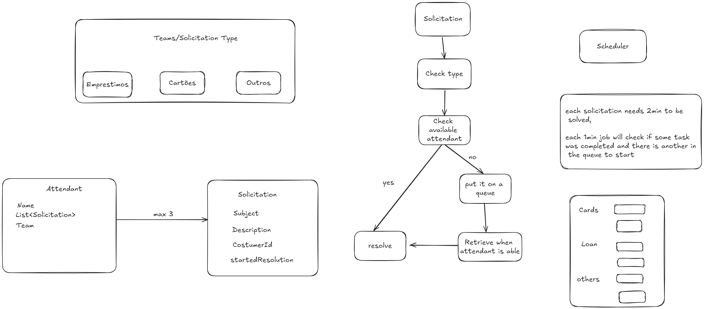

# api-invext-ubots

##  💼 Desafio técnico Invext - Ubots
**Padrão arquitetural**

`Para essa solução utilizei a implementação do DDD - Domain Driven Design
sendo assim, dividi a aplicação em Dominio(itens de dominio/entidades),
aplication(entrada da aplicação controller/handlers) e infraestrutura(serviços agendados, bd, serviços externos etc.),
usando também linguagem ubíqua utilizando de termos que possam ser entendidos por todos os stakeholders.`

> A imagem acima é um breve rascunho de como seria minha ideia para a criação da api,
> relacionamentos e logica para a implementação. Abaixo, breve descritivo:
> - `Minha ideia foi permitir que atendentes sejam cadastrados nos 3 possiveis times.`
> - `Solicitações sejam enviadas por assuntos e distribuidas para os possíveis atendentes dos respectivos times,
 caso o time esteja todo ocupado a mensagem vai para uma fila FIFO, e um processo agendado de x em x tempo
(tempo um pouco menor que o tempo necessáro para o atendimento da solicitação, para que mensagens não fiquem muito tempo paradas na fila)
verifica se alguém ja está disponível para atender.`
> - `Algumas validações basicas foram feitas, busca por atendente não encontrado (not found) e assunto inválido.`

## 💻 Pré-requisitos

- `Java 21`
- `IDE Eclipse/IntelliJ [...]`
- `A collection está disponível na pasta raíz em postman_collection, basta importar`
- `Swagger em: http://localhost:8080/invext/swagger-ui/index.html#/`